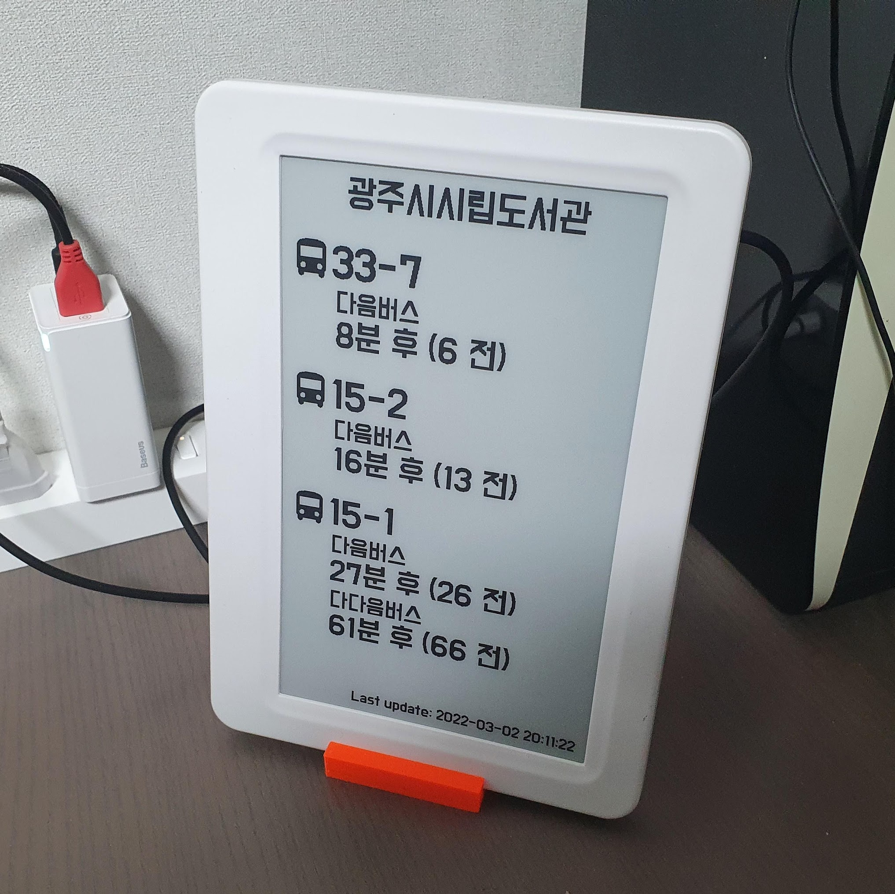

# gbis-frame
경기버스정보액자: 집앞 버스 정류장의 버스 정보 상황판을 집안으로

## requirement
라즈베리파이와 e-paper 모듈 epd7in5v2를 사용함.

공공데이터포털에서 다음의 OPEN API 개발 계정을 신청해야 함.
각 서비스에서 같은 service key 가 주어지지만 모두 신청하지 않으면 안됨.

* 경기도-버스 도착 정보 조회 서비스 (REST)
* 경기도-버스노선 조회 서비스 (REST)
* 경기도-정류소 조회 서비스 (REST)

## build

    GOOS=linux GOARCH=arm go build

## run

    SERVICEKEY="your_baseinfo_servicekey" \
    ./gbis-frame

## references
* [공공데이터포털](https://www.data.go.kr/)
* [경기버스정보](http://www.gbis.go.kr/)
* GB202 서비스+명세서_경기버스정보_버스노선조회_REST.doc
* GB203 서비스+명세서_경기버스정보_정류소조회_REST.doc
* GB208 서비스+명세서_경기버스정보_버스도착정보조회_REST.doc